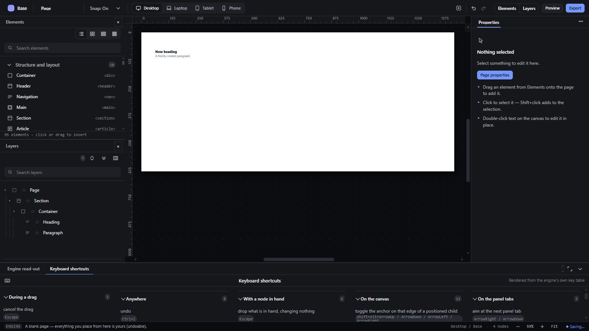

# shortcuts-panel — Keyboard shortcuts panel generated from the keymap

How Pager behaves, observed by running it from `.cache/pager-run` (Chrome, window 1600×900) and read from its source. Source references are `path:line` inside Pager.

## Trigger

- Command bar → `Open Keyboard shortcuts` (observed), or the workbench tab when Developer tools are on. There is no Help → Keyboard shortcuts row (Help lists shortcuts as runnable rows instead; see `app-menu.md`).
- The panel is a workbench (`bench`) tool (`src/features/shortcuts/index.js:51-62`).

## Hit zones and thresholds

The panel is generated from the `KEYMAP` table in `src/features/input/index.js:660-833`, grouped by `when` (`shortcuts/index.js:29-49`). Keys are shown with modifiers (`Ctrl+`, `Shift+`, `Alt+`) and single letters upper-cased.

## Visual feedback

| Stage | What is drawn | Image |
|---|---|---|
| Panel open | The workbench opens with tabs `Engine read-out` and `Keyboard shortcuts` (selected). Groups with counts: **During a drag** (3), **Anywhere** (8), **With a node in hand** (6), **On the canvas** (11), **On the panel tabs** (3) — 31 rows, e.g. `cancel the drag — Escape`, `raise the receiver level — ArrowUp`, `undo — Ctrl+Z`, `redo — Ctrl+Y`. |  |

## Result in the document

None.

## Undo and redo

Not applicable.

## Nested elements

Not applicable.

## Zoom other than 100 %

Not affected.

## Keyboard equivalent

Not applicable.

## Problems in Pager

1. **The panel lists only the `KEYMAP` rows.** Shortcuts declared as commands (`Ctrl+D`, `Ctrl+K`, `Ctrl+B`, `Ctrl+Alt+B`, `Ctrl+\`, `Ctrl+=`, `Ctrl+-`, `Ctrl+0`, `Ctrl+'`, `Ctrl+P`, `Alt+Shift+Arrows`), text-editing keys (`Ctrl+B/I/K`, Enter, Shift+Enter, Escape), guide keys, spacing-band keys and menu keys are missing. Required: one keymap table holds every binding; the panel lists all of them grouped by context (anywhere, on the canvas, while editing text, during a drag, with something in hand, on panels) with keys and a description (features.json `shortcuts-panel`).
2. **Descriptions are lower-case developer phrases** ("raise the receiver level") in English only. Required: descriptions come from i18n (pt-BR by default).
3. **No Help → Keyboard shortcuts door.** Required: Help → Keyboard shortcuts opens the panel as a tab in the bottom workbench.
