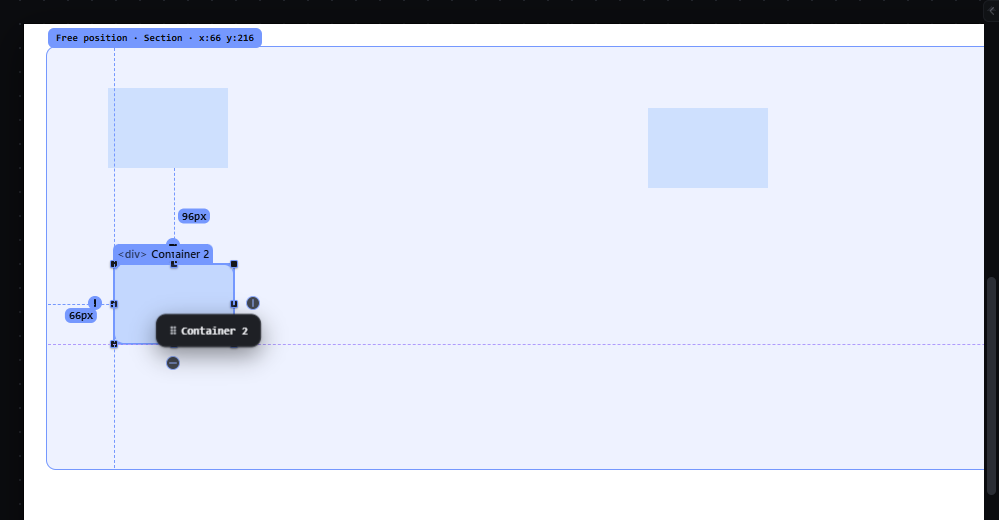

# smart-guides — Smart alignment and equal spacing guides

How Pager behaves, observed by running it from `.cache/pager-run` (Chrome, window 1600×900) and read from its source. Source references are `path:line` inside Pager. The drag gesture and the snap targets are those of `absolute-free-drag.md` and `snap-while-moving.md`.

## Trigger

- In Pager, "smart guides" are **the snap switch under another name**: the Guides & Grids panel row **Smart guides** ("Alignment and spacing hints") calls the same `gdpSetSmart` as the top bar's Snap menu (`src/features/precision/index.js:115-123`, `:384-391`). There is no way to see alignment hints without snapping, or to snap without them.
- **Equal spacing** is a separate switch in the same panel ("Detect repeated gaps while dragging in Free mode"), stored in `page.snap.equalSpacing` (`:435-442`).

## Hit zones and thresholds

- Alignment: the dragged box's left/centre/right and top/middle/bottom against siblings, parent and page, within the snap distance (default 6 px × zoom) — see `snap-while-moving.md`.
- Equal spacing: for every pair of siblings that overlap by at least 25 % on the other axis, the gap between them is a candidate; the dragged box is pulled so its gap to one of them equals that gap, within 1.5 × the snap distance, only on an axis where no edge snapped (`src/platform/box-geometry.js:57-83`, `:116-120`).

## Visual feedback

| Stage | What is drawn | Image |
|---|---|---|
| Alignment during a free drag | A dashed accent line through the aligned edge (`gd v` / `gd h`), violet when the match is a centre (`style/06-canvas-chrome.css:104-110`); distance markers to the nearest element above and to the left (`src/platform/overlay.js:253-259`). |  |
| Equal spacing | **Nothing is drawn**: the snapped position is applied, but no marker shows the repeated gap (`drag.js:705` computes `eq`; `overlay.js` never draws it). | — |

## Result in the document

The stored `left`/`top` are the snapped values (see `snap-while-moving.md`).

## Undo and redo

Part of the drag; one history entry.

## Nested elements

Siblings only.

## Zoom other than 100 %

Thresholds scale with the zoom.

## Keyboard equivalent

None.

## Problems in Pager

1. **Smart guides and snap are one switch.** Required: the Guides & Grids dialog has a Smart guides toggle under Visibility and an Equal spacing toggle; turning smart guides off removes the alignment lines and equal-spacing markers but does not turn snap off; the snap distance comes from Snap settings (one setting) (features.json `smart-guides`).
2. **Equal spacing is invisible.** Required: when the gaps are equal, equal-spacing markers are drawn on both gaps with their value, and with snap on the box snaps to the equal-gap position.
3. **Alignment lines appear only when a snap happened.** Required: alignment lines appear whenever edges or centres align with other elements (within the snap distance), whether or not snap is on.
