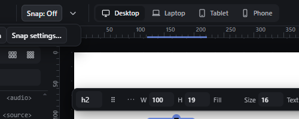
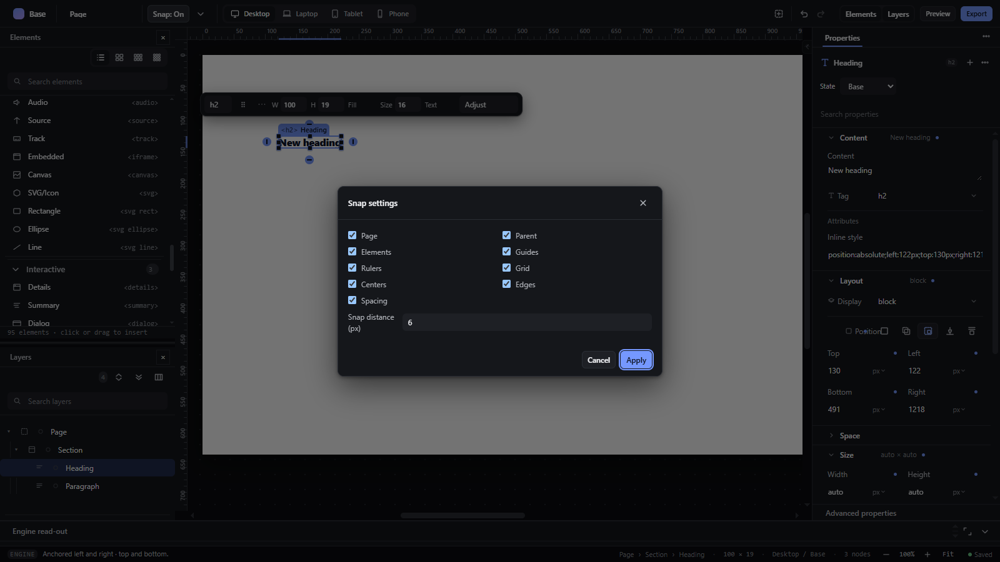

# snap-toggle-settings — Snap on/off and snap settings

How Pager behaves, observed by running it from `.cache/pager-run` (Chrome, window 1600×900) and read from its source. Source references are `path:line` inside Pager.

## Trigger

- Top bar: a **Snap** button labelled `Snap: Off` / `Snap: On` and a chevron; both open the same small menu with **Off**, **On** (radio items) and **Snap settings…** (`src/features/precision/index.js:44-70`). Clicking the button does **not** toggle snap by itself; it opens the menu.
- Snap settings… opens a modal dialog `Snap settings` with nine checkboxes and a distance field, **Cancel** and **Apply** (`:56-65`).
- The Guides & Grids panel's **Smart guides** switch is the same flag (`gdpSetSmart`, `:115-123`, `:384-391`).

## Hit zones and thresholds

- Default: snap **off** (`gdpFlagsDefault.smart = false`, `:77`); the on/off flag is a preference in `localStorage` (`pe-guides-v2`), the targets and distance are stored in the page (`page.snap`, `:107-113`).
- Targets: Page, Parent, Elements, Guides, Rulers, Grid, Centers, Edges, Spacing (`SNAP_TARGETS`, `:26`), all on by default.
- Distance: default **6 px**, range 0-64 px (`:62`, `:110`); it is multiplied by the zoom when compared with screen positions.
- With snap off the radius is −1: no target attracts (`:115`, `MEASURE_LIMITS.SNAP`).

## Visual feedback

| Stage | What is drawn | Image |
|---|---|---|
| Top bar, snap off | `Snap: Off` button with a chevron. |  |
| Menu open | `Off` (checked), `On`, `Snap settings…`. |  |
| Snap settings dialog | Two columns of checkboxes (Page, Parent, Elements, Guides, Rulers, Grid, Centers, Edges, Spacing), `Snap distance (px)` = 6, Cancel / Apply. |  |

Choosing On changes the button to `Snap: On` (observed).

## Result in the document

- Apply writes `page.snap = {targets, equalSpacing, distance}` into the project through `editProject` (so it is part of the document and of the history), then turns snap on if the distance is ≥ 0 (`:64`).
- Cancel discards the dialog's changes.
- On/Off is a preference, not document data.

## Undo and redo

Apply is a project edit (undoable); toggling On/Off is not.

## Nested elements

Not applicable.

## Zoom other than 100 %

The distance is in CSS px at 100 % and scales with the zoom on screen.

## Keyboard equivalent

None (the code comment mentions a `G` key, but no binding exists).

## Problems in Pager

1. **The top-bar button does not toggle;** it opens a menu, so switching snap takes two clicks. Required: the button toggles between `Snap: Off` and `Snap: On`; the chevron opens the menu with Snap settings (manifest feature `snap-toggle-settings`).
2. **Apply silently turns snap on.** Required: Apply stores the settings in the preferences store and leaves the on/off state as it was (manifest intent: "Apply stores the settings in preferences").
3. **Snap targets and distance are stored in the page document** while the on/off switch is a preference. Required: all snap settings are workspace preferences, in the one preferences store.
4. **"Smart guides" and "Snap" are one flag under two names.** Required: separate settings, as `smart-guides.md` requires (smart guides can be visible while snap is off and vice versa).
