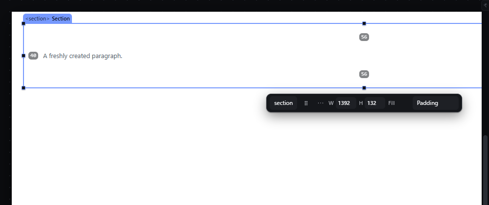
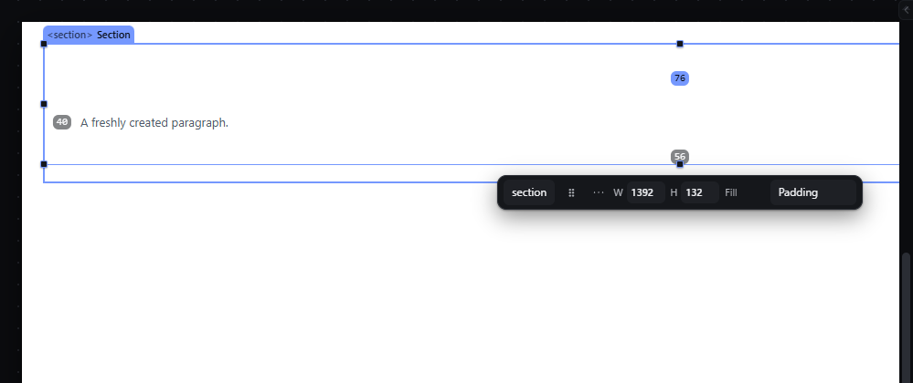
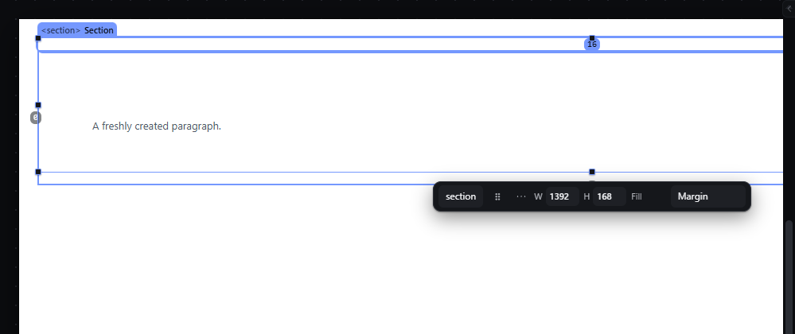
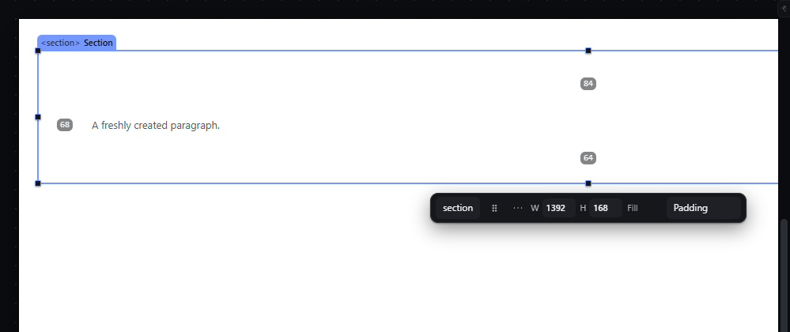

# spacing-handles — Edit padding and margin by dragging on the canvas

How Pager behaves, observed by running it from `.cache/pager-run` (Chrome, window 1600×900) and read from its source. Source references are `path:line` inside Pager. Test document: Section (`padding: 56px 40px`) > Paragraph, Section selected.

## Trigger

- Choose **Padding** or **Margin** in the quick panel's "Edit on canvas" select (default label `Adjust`; `src/features/inspector/quick-panel.js:416-425`), or press the quick panel's Margin / Padding action buttons (`:392-395`). This turns on a spacing mode (`setSpacingMode`, `src/features/spacing/handles.js:74-75`).
- In a mode, the four sides of the selected element are drawn as bands; primary-button press on a band arms a drag (`handles.js:164-193`), which starts after **4 px** (`:203`).
- Modifiers: **Shift** changes all four sides, **Ctrl/Cmd** changes the side and its opposite, and also suspends snapping (`src/features/spacing/model.js:70-79`, `handles.js:205-207`). **Alt does nothing** (observed).
- A press released without moving opens a typed field on the band (`handles.js:235`, `:273-283`); double-click and Enter on a focused band do the same (`:120-123`).
- `Escape` cancels a drag (`:246-250`); `Escape` outside a drag also closes the quick panel mode (`quick-panel.js:114`).
- Ctrl + hover measurement lines (`initMeasureHover`, `handles.js:370-499`) offer a second door: dragging a container distance line drags that container's padding on that side.

## Hit zones and thresholds

- Padding bands lie inside the border, as thick as the padding on that side and never thinner than **6 px** (`SPACING_MIN_BAND_PX`, `model.js:3`, times the zoom); top and bottom span the full width, left and right fill between them (`model.js:13-22`). Measured on the Section: top band 1392 × 56 px, left band 40 × 20 px.
- Margin bands lie outside the border, as thick as the margin, min 6 px; negative margins are drawn inward (`model.js:23-35`).
- Change = pointer movement along the side's normal ÷ zoom: dragging the top padding band **down** grows it, the bottom band **up** grows it; margins grow outward (`model.js:55-66`). Padding never goes below 0; margins can be negative (`:75`).
- With Snap on, the value snaps within the snap distance to 0, sibling values, ruler steps and grid steps (`handles.js:26-39`).
- The typed field accepts `12`, `12px`, `1.5rem`, `%`, `em`; `auto` for margins; ArrowUp/ArrowDown ±1, Shift ±10 (`model.js:82-98`, `:143-156`).

## Visual feedback

| Stage | What is drawn | Image |
|---|---|---|
| Padding mode on | The bands themselves are not tinted; only a small grey value chip per side is visible (`56`, `40`, `56`; the right one is off screen). Each band has a resize cursor and the tooltip `Padding top: 56px — drag to change; Shift moves all four, Ctrl the opposite pair`. The quick panel select reads `Padding`. |  |
| Dragging the top band down 20 px | The element re-lays out live; the chip shows the live value; status `Padding 76px 40px 56px`. |  |
| Margin mode, top band dragged up 16 px | Status `Margin 16px 0px 0px`, then `Margin set to 16px 0px 0px.` |  |
| Click on a band | In the code this opens a typed field on the band; in the run, a click at the middle of the top band did not leave a field open. |  |

## Result in the document

Observed on the Section (`padding: 56px 40px`):

| Gesture | Written |
|---|---|
| top band +20 px | `paddingTop: 76px` (the `padding` shorthand stays) |
| left band +10 px with Alt | `paddingLeft: 50px` only |
| left band +10 px with Ctrl | `paddingLeft: 60px`, `paddingRight: 50px` |
| bottom band −8 px with Shift | all four sides +8: `84px 58px 64px 68px` |
| margin top +16 px | `marginTop: 16px` |

Only the sides that changed are written, as longhands, on the active breakpoint/state layer (`handles.js:209-210`, `:253-269`); status `Padding set to 76px 40px 56px.`

## Undo and redo

One history entry per drag or typed value.

## Nested elements

Only the selected element's own padding and margin; in a flex/grid parent the parent reflows.

## Zoom other than 100 %

Band thickness and the minimum 6 px scale with the zoom; the value change is the pointer movement ÷ zoom.

## Keyboard equivalent

Focus a band (it is focusable) and press Enter to type a value; the Inspector's Space section is the full keyboard route.

## Problems in Pager

1. **The bands are invisible except for their value chips.** Required: in Padding or Margin mode the four sides are drawn as tinted bands with their values (features.json `spacing-handles`), padding and margin in different design-token colours.
2. **The modifiers differ from features.json:** Ctrl changes the opposite pair and Alt does nothing. Required: Alt changes the opposite side by the same amount; Shift changes all four sides.
3. **Ctrl both pairs sides and disables snapping** in the same gesture. Required: one modifier per meaning, from the keymap owner.
4. **The drag writes longhands next to an existing shorthand** (`padding: 56px 40px` plus `paddingTop: 76px`), so the Inspector and export must resolve two sources. Required: the written result is one coherent value per side (update the shorthand when all four sides are known, otherwise replace it by four longhands).
5. **A click on a band does not reliably open the typed field** (observed: no field after a click in the middle of the top band). Required: a click without drag opens the typed field; Enter commits, Escape cancels.
