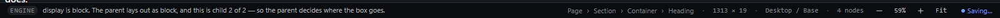

# status-bar — Status bar: messages, breadcrumb, size, context, count, zoom and save state

This file covers the interactive parts of the status bar (the breadcrumb and the zoom controls) and what each part shows. Observed by running Pager from `.cache/pager-run` (Chrome, window 1600×900) and read from its source; references are `path:line` inside Pager.

## Trigger

- Clicking an ancestor in the breadcrumb selects it (each crumb is a button calling `select(node)`, `src/features/workspace/shell.js:214-224`, wired in `src/features/workspace/camera.js:57-60`).
- The zoom `−`, `+`, percentage and `Fit` controls (see `zoom-keyboard-buttons.md`).
- Messages are written by commands through the read-out line and mirrored into the status bar (`src/app/boot.js:801-803`).

## Hit zones and thresholds

The status bar is one 26 px line: tag + message on the left (`role="status"`), then the facts: breadcrumb (`#sbPath`), size (`#sbSize`), breakpoint / state (`#sbBp`), node count (`#sbNodes`), zoom controls, save state.

## Visual feedback

| Stage | What is drawn | Image |
|---|---|---|
| Heading inside Section > Container selected | `ENGINE <last message>` · `Page › Section › Container › Heading` · `1313 × 19` · `Desktop / Base` · `4 nodes` · `− 100% + Fit` · `● Saved`. |  |

Clicking `Section` in the breadcrumb selected the Section; the facts became `Page › Section`, `1393 × 151` (observed). The message tag changes with the source: `ENGINE`, `TEXT`, `CANVAS`, `WORKSPACE`, `GRID`, `GUIDES`, `BREAKPOINTS`, `STATES`, and `REFUSED` for refusals.

## Result in the document

Breadcrumb clicks change only the selection.

## Undo and redo

Not applicable.

## Nested elements

The breadcrumb lists every ancestor of the primary selection.

## Zoom other than 100 %

The zoom percentage is part of the bar.

## Keyboard equivalent

The status bar is a Tab stop (`data-region="status"`), but its breadcrumb buttons are sealed out of the Tab order.

## Problems in Pager

1. **Messages go stale:** the last message stays until another command writes one (e.g. `Text edit cancelled — …` remained while other things happened), with no time or fading. Required: the message line shows the last command's message in an aria-live region and is cleared or replaced when the context changes (manifest feature `status-bar`).
2. **The breadcrumb is not reachable by keyboard.** Required: breadcrumb items are buttons reachable with Tab/arrow keys inside the status region.
