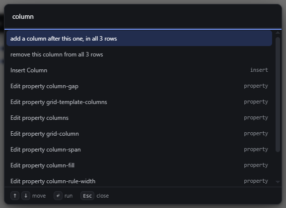
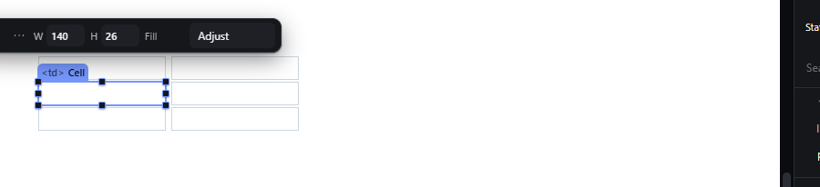

# table-commands — Add and remove table rows and columns

How Pager behaves, observed by running it from `.cache/pager-run` (Chrome, window 1600×900) and read from its source. Source references are `path:line` inside Pager. Test table: Table > Head > Row > [Header cell, Header cell]; Body > Row > [Cell, Cell], Row > [Cell, Cell]. Inserting **Table** from the palette creates an **empty** `<table>` (observed), so the structure was built cell by cell.

## Trigger

- Two table commands exist, both registered in `src/app/boot.js:222-227` and implemented in `boot.js:300-323`:
  - `selection.addColumn`, labelled by context:
    - from a cell: `add a column after this one, in all N rows`;
    - from the table, a row group or a row: `add a column at the end of all N rows`.
  - `selection.deleteColumn`, `remove this column from all N rows`, available only from a cell.
- **Their only door is the command bar** (`Ctrl+K`, type `column`). They are not in the context menu (whose items are fixed, see `context-menu.md`), not in the selection bar or its `More actions`, and have no key.
- There is **no add-row and no remove-row command**:
  - `create <tr> inside` (the natural-child command, see `natural-child-command.md`) on a Body appends an **empty** `<tr>` with no cells (observed: `Created inside: Row`, `children: []`);
  - Delete on a selected Row removes it (`Removed: Row 3`).

## Hit zones and thresholds

The column index is the selected cell's index in its row + 1 (`boot.js:306`); from a non-cell the column goes to the end. The rows are every row of every row group of the table (`tableRows`). A new cell is `th` in a head row and `td` elsewhere (`cellTypeFor`, `boot.js:308`). A locked row or cell refuses the whole command (`cmd.lockedNode`, `:303-304`, `:316-317`).

## Visual feedback

| Stage | What is drawn | Image |
|---|---|---|
| A Cell selected, `More actions` open | The selection bar offers no table command. |  |
| Command bar, query `column`, a Cell selected | `add a column after this one, in all 3 rows` and `remove this column from all 3 rows` at the top. |  |
| After adding a column after the first cell | The new cells are created **without any style**, so in this table (cells styled 140 px with a border) the new column collapses and is **not visible**; the first cell stays selected. |  |

## Result in the document

Observed (cells named by key):

| Action | Rows after |
|---|---|
| start | `[th1 th2] [td1 td2] [td3 td4]` |
| add a column after `td1` | `[th1 th3 th2] [td1 td5 td2] [td3 td6 td4]`; status `Column created in 3 row(s)`; `td1` stays selected |
| add a column at the end (Body selected) | `[th1 th3 th2 th4] [td1 td5 td2 td7] [td3 td6 td4 td8]` |
| remove this column (`td2`, index 3) | `[th1 th3 th4] [td1 td5 td7] [td3 td6 td8]`; status `Column 3 removed from 3 row(s)`; the **table** becomes the selection |
| `create <tr> inside` on the Body | a new empty `[]` row |
| Delete on the last Row | the row is removed; status `Removed: Row 3`; nothing selected |

## Undo and redo

Each command is one transaction and one undo step (observed: Ctrl+Z after adding a column restored `[th1 th2] [td1 td2] [td3 td4]` with `↶ Undone`; Ctrl+Shift+Z re-added it).

## Nested elements

Only the rows of the selected cell's own table are touched; a table nested in a cell is a different table (`tableOf` finds the nearest).

## Zoom other than 100 %

Not affected.

## Keyboard equivalent

Ctrl+K, type, Enter. No direct keys.

## Problems in Pager

1. **No row commands.** Required: `Add a row after this one` copies the row's cell structure (same count, `th`/`td` per position) with empty cells, and `Remove this row` removes it; each is one undo step (manifest feature `table-commands`).
2. **Table commands are missing from the context menu.** Required: with a cell selected, the context menu offers `Add a column after this one`, `Add a column at the end`, `Remove this column`, `Add a row after this one` and `Remove this row`, running the same commands as the command bar.
