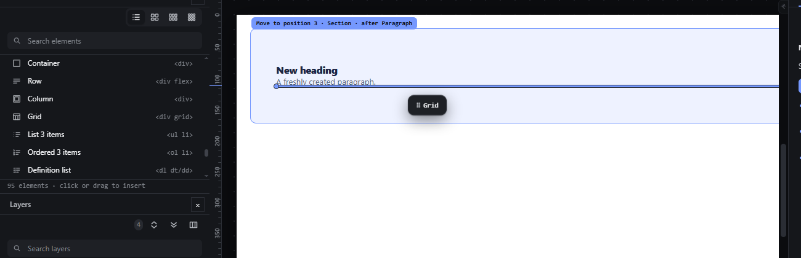
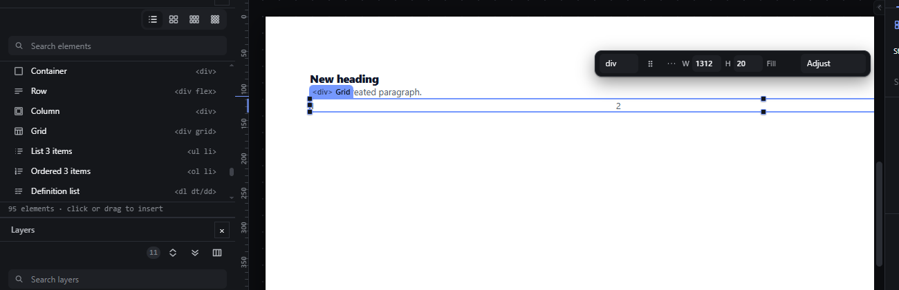

# templates-layout — Layout templates: Container, Row, Column, Grid

How Pager behaves, observed by running it from `.cache/pager-run` (Chrome, window 1600×900) and read from its source. Source references are `path:line` inside Pager.

## Trigger

- The Elements panel's **Templates** group lists `Container 
`, `Row 
`, `Column 
`, `Grid 
` (`src/features/palette/index.js:51-53`), followed by the content templates.
- Click a tile: the same insert as any palette click (placement at the selection, see `palette-click-insert.md`).
- Drag a tile: the same palette drag as any element (see `palette-drag-insert.md`); the ghost reads `⠿ Grid`.
- Enter/Space on a focused tile inserts too.
- The trees are built by `PRESET` in `src/model/templates.js:114-121`.

## Hit zones and thresholds

As for palette click and palette drag (4 px drag threshold; same drop zones).

## Visual feedback

| Stage | What is drawn | Image |
|---|---|---|
| Dragging the Grid tile below a Paragraph | The ghost chip `⠿ Grid`, the receiver (Section) tinted, the insertion line after the Paragraph, and the pill `Move to position 3 · Section · after Paragraph`. |  |
| After the drop | The Grid is inserted and selected (outline, `
 Grid` chip, quick panel). |  |

## Result in the document

Observed (Section selected, one click each):

| Template | Tree inserted (styles in the document JSON) | Status |
|---|---|---|
| Container | `div "Container" {display:flex; flex-direction:column}` > Paragraph `Content` | `Placed. Container in Section, position 1 of 1.` |
| Row | `div "Row" {display:flex; flex-direction:row; gap:16px}` > 2 × `div "Column" {display:flex; flex-direction:column}`, each with a Paragraph `Column 1` / `Column 2` | `Placed. Row in Section, position 2 of 2.` |
| Column | `div "Column 3" {display:flex; flex-direction:column}` > Paragraphs `Block 1`, `Block 2` | `Placed. Column in Section, position 3 of 3.` |
| Grid | `div "Grid" {display:grid; grid-template-columns:repeat(3, minmax(0, 1fr)); gap:16px}`, with `tablet: repeat(2, minmax(0, 1fr))` and `phone: minmax(0, 1fr)` overrides > 3 × `div "Cell" {display:flex; flex-direction:column}` with Paragraphs `1`, `2`, `3` | `Placed. Grid in Section, position 4 of 4.` |

- The template's root is selected after each insert.
- Dragging the Grid below the Paragraph inserted it at position 3 in the Section. The computed `grid-template-columns` in the iframe was `426.656px 426.672px 426.656px`.
- Names are numbered across the page: the Column template became `Column 3` because the Row had already created `Column` and `Column 2`.

## Undo and redo

One insert, one undo step (observed: one Ctrl+Z removed the whole Grid; Ctrl+Shift+Z restored it).

## Nested elements

The template is inserted as one subtree; its inner containers are ordinary nodes afterwards.

## Zoom other than 100 %

As for palette drag.

## Keyboard equivalent

Enter/Space on a focused tile.

## Problems in Pager

1. **Template wrappers and wrap-command wrappers have different styles:**
   - The Row template has `gap: 16px`, the `R` wrapper has none and sometimes adds `align-items: center` (`src/features/input/index.js:801-810`).
   - The template columns are flex columns, the side-drop wrappers are built by other code (`src/features/drag/drag.js:1192-1198`, `:1259-1262`).

   Required: templates and wrap commands take their Row/Column layout styles from the same owner (features.json `templates-layout`).
