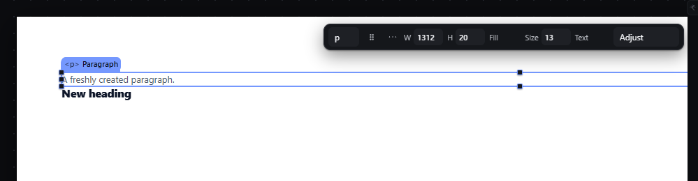

# text-edit-inline — Edit text in place with double-click or Enter

How Pager behaves, observed by running it from `.cache/pager-run` (Chrome, window 1600×900) and read from its source. Source references are `path:line` inside Pager. Test document: Section > [Paragraph, Heading].

## Trigger

- **Double-click** on a text element on the canvas (`dblclick` on the canvas, `src/app/boot.js:731-734`), or two single clicks on the same selected element within **450 ms** (`boot.js:715-729`).
- **Enter** with the canvas focused and exactly one element selected (`src/features/input/index.js:762-764`).
- The quick panel's "edit text" action calls the same door (`provide("editText")`, `boot.js:575`).
- Refused silently (returns false, nothing happens) when the element is not textual, is locked, is part of a multi-selection, or in preview (`boot.js:586-587`). Textual types: the `TEXTUAL` set, `textarea`, and `input` except `file` (`src/features/inspector/catalogue.js:246`).

## Hit zones and thresholds

- The whole element box is the double-click target.
- While editing, the element is `contenteditable="true"` and focused without scrolling the canvas (`boot.js:603`, `:640`); if it is outside the stage it is first scrolled into view (`:592-597`). The caret is placed at the **end** of the text, not where the click landed (`:641-646`).
- Keys while editing are the editor's: the canvas keymap ignores events whose focus is a contenteditable (`keyFocus` → `FOCUS_TEXT`, `input/index.js:465-491`). Observed: Delete, ArrowLeft and `r` changed the text only; the tree was unchanged.
- `Enter` commits (`boot.js:690-694`); `Shift+Enter` inserts a line break character (`insertPlain("\n")`); `Escape` cancels (`:685-687`); **blur** (clicking elsewhere) commits (`:660`).
- Paste inserts `text/plain` only (`:661-665`); dropped text is inserted as plain text (`:666-672`); browser formatting commands other than bold, italic, link and remove-format are blocked (`src/features/text-edit/index.js:10-17`).
- A multi-character `insertText` repeated within 250 ms is ignored (IME/autofill burst guard, `boot.js:673-683`).

## Visual feedback

| Stage | What is drawn | Image |
|---|---|---|
| After double-click | The selection chrome stays exactly as for a selected element (outline, chip, handles, quick panel); the caret blinks at the end of the text. The status bar tag switches to `TEXT` with `Editing plain text — Enter or click away to keep it, Escape to cancel.` |  |
| Enter after typing `Hello world` | Editing ends; status `Text kept.` |  |
| Escape after typing | The text returns to what it was; status `Text edit cancelled — the element is back to what it said.` |  |

## Result in the document

- On commit the element's text (and its inline tree when it has marks, see `text-inline-formatting.md`) is written in one transaction, only if it changed (`boot.js:656`, `text-edit/index.js:101-105`).
- Observed: `A freshly created paragraph.` → double-click, Ctrl+A, type `Hello world`, Enter → `text: "Hello world"`. Enter again, type ` more`, Escape → still `Hello world`. Double-click, type ` again`, click the Heading → `Hello world again`, and the Heading becomes the selection.
- Shift+Enter then `line2`, Enter → the stored text was `Hello world againline2`: **the line break was lost** (observed).

## Undo and redo

A committed edit is one history entry; a cancelled edit adds none.

## Nested elements

Only the double-clicked element becomes editable; inline marks inside it stay editable text.

## Zoom other than 100 %

Editing happens in the zoomed iframe; the caret and text scale with the zoom.

## Keyboard equivalent

`Enter` on the selected element starts editing; `Enter` commits, `Escape` cancels.

## Problems in Pager

1. **Shift+Enter loses the line break.** The inserted `\n` is collapsed on read-back (observed `…againline2`). Required: either Shift+Enter stores a real line break that survives commit, render and export, or Shift+Enter is not offered; never a keystroke that silently disappears.
2. **The editing state looks identical to the selected state** (same outline, handles and quick panel), so only the status bar tells the person that typing goes into the text. Required: while editing, the resize handles and quick panel are hidden and the outline uses a distinct editing style from the design tokens.
3. **Refusals are silent** (double-click on a locked or multi-selected element does nothing and says nothing). Required: the status bar says why editing did not start.
4. **A text left empty could not be seen nor clicked** (the user's real-use audit, A3.38: a heading whose text was cleared was 0 px tall on the canvas, reachable only through Layers). Required: on the canvas only (never in the document nor the export), a text element whose text is empty keeps canvas.emptyTextMinHeight of height and a dashed outline in its own colour, so it can be seen and clicked; the Layers row says it is empty; the element edited in place drops the mark while it is edited.
