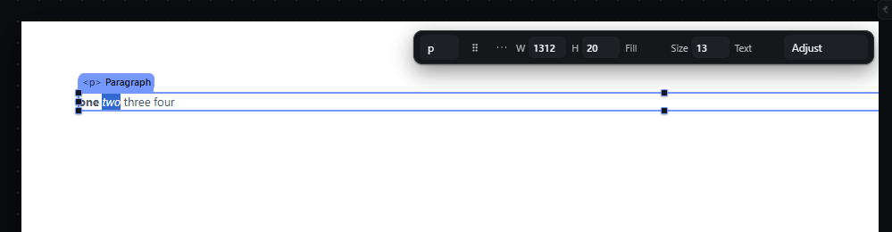
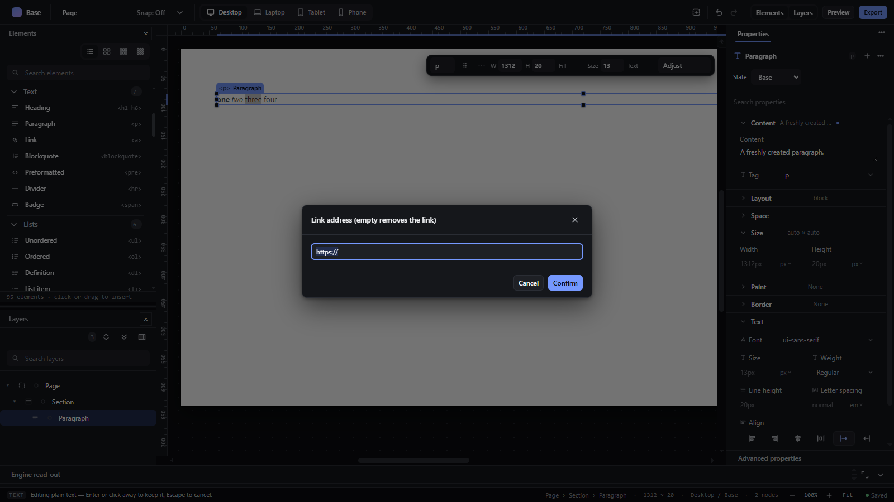

# text-inline-formatting — Bold, italic and links inside text with Ctrl+B, Ctrl+I and Ctrl+K

How Pager behaves, observed by running it from `.cache/pager-run` (Chrome, window 1600×900) and read from its source. Source references are `path:line` inside Pager. Test: a Paragraph edited in place (see `text-edit-inline.md`) with the text `one two three four`.

## Trigger

While a text element is being edited, `Ctrl` (or `Cmd`) + `B`, `I`, `K` or `U` is handled by the text editor, `preventDefault` + `stopPropagation`, so no editor shortcut runs (`src/app/boot.js:695-702`, `src/features/text-edit/index.js:61-84`).

| Keys | Effect |
|---|---|
| Ctrl+B | wrap the selected text in `<strong>`; inside an existing `<strong>`, unwrap it |
| Ctrl+I | same with `<em>` |
| Ctrl+K | open the modal prompt `Link address (empty removes the link)` pre-filled with the current link's `href` or `https://`; the answer wraps the selection in `<a href>`, re-addresses an existing link, or (empty / `https://`) removes it |
| Ctrl+U | swallowed: nothing happens (no underline element) |

## Hit zones and thresholds

- The wrap applies to the current text selection inside the element; a collapsed selection does nothing for B/I (`text-edit/index.js:47`).
- "Inside a mark" is decided by the closest ancestor of the selection's common container (`:25-29`, `:44-46`): pressing Ctrl+B with a selection inside a bold word removes the whole `<strong>`, not only the selected part.
- Link addresses pass the URL safety rule: only `http`, `https`, `mailto`, `tel`, `ftp` (`src/model/urls.js:5-7`, `text-edit/index.js:78`). An unsafe address is ignored silently.

## Visual feedback

| Stage | What is drawn | Image |
|---|---|---|
| `one` + Ctrl+B, `two` + Ctrl+I | Live in the element: `<strong>one</strong> <em>two</em> three four`. |  |
| `three` + Ctrl+K | A modal dialog over the whole window, titled `Link address (empty removes the link)`, field pre-filled `https://`, Cancel / Confirm. |  |

## Result in the document

Observed step by step (innerHTML of the edited element):

1. Ctrl+B on `one`, Ctrl+I on `two` → `<strong>one</strong> <em>two</em> three four`
2. Ctrl+K on `three`, `https://example.com` → `… <a href="https://example.com">three</a> four`
3. Ctrl+B again inside `one` → the `<strong>` is removed; Ctrl+U → no change
4. Ctrl+K on `four` with `javascript:alert(1)` → no change, no message
5. Pasting `text/html` `<b>RICH</b> <i>x</i>` at the end → inserted as plain `RICH x`
6. Enter → the node stores `text: "one two three fourRICH x"` and `inline: ["one ", {tag:"em", children:["two"]}, " ", {tag:"a", href:"https://example.com", children:["three"]}, " fourRICH x"]`; the export writes `
one <em>two</em> <a href="https://example.com">three</a> fourRICH x
`.

The plain `text` is always stored; the `inline` tree is stored only when there is formatting (`text-edit/index.js:101-105`).

## Undo and redo

Formatting is part of the text edit: the whole edit, marks included, is one history entry on commit. There is no undo inside the edit other than the browser's own.

## Nested elements

Marks nest (a `<strong>` inside a link is kept); links are not nested inside links (`src/model/inline-markup.js:27-29`).

## Zoom other than 100 %

Not affected.

## Keyboard equivalent

The shortcuts are the doors; there is no toolbar for marks.

## Problems in Pager

1. **An unsafe link is dropped silently.** Required: the prompt shows an error (`Links must start with http, https, mailto or tel`) and stays open; nothing is written (manifest intent: unsafe URLs such as `javascript:` are refused).
2. **Ctrl+B inside part of a bold run removes the whole run.** Required: toggling a mark applies to the selected range only (splitting the run when needed).
3. **Pasting rich text drops all formatting:** the paste inserts `text/plain` only (`src/app/boot.js:661-665`). Required: pasted content keeps the supported marks (strong, em, and links with safe URLs) and drops everything else, other tags becoming their plain text and scripts removed (manifest feature `text-inline-formatting`).
