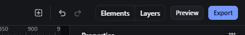

# undo-redo — Undo and redo every document change

How Pager behaves, observed by running it from `.cache/pager-run` (Chrome, window 1600×900) and read from its source. Source references are `path:line` inside Pager.

## Trigger

| Input | Where it works | Source |
|---|---|---|
| `Ctrl+Z` (also `Cmd+Z`) | anywhere except while typing in a text field or a contenteditable (focus "chrome" or canvas) | `src/features/input/index.js:669-670` |
| `Ctrl+Shift+Z` | same | `:671-672` |
| `Ctrl+Y` | same | `:673-674` |
| Top bar Undo / Redo buttons (`#bU`, `#bR`) | click | `src/app/boot.js:355-358` |
| Edit menu Undo / Redo | click | `src/features/workspace/dock.js:401-403` |

All five doors call the same two functions, `historyBack` and `historyForward` (`src/commands/transactions.js:150-157`). While a pointer drag is live, keys go to the drag instead (`boot.js:548-554`).

## Hit zones and thresholds

- History granularity: one entry per transaction. A transaction whose document is unchanged at the end is dropped (`transactions.js:161-169`), so no-op commands never create entries.
- Depth: at most **80** undo entries; the oldest is dropped (`transactions.js:210`).
- Any new command empties the redo stack (`transactions.js:210`, `REDO=[]`).

## Visual feedback

| Stage | What is drawn | Image |
|---|---|---|
| After three undos | The document returns step by step; the status bar reads `↶ Undone` each time; both buttons are enabled while each stack has entries (`boot.js:351-353` disables a button whose stack is empty). |  |
| New command after an undo | Redo becomes disabled. |  |

Redo shows `↷ Redone`. There is no preview of what will be undone (the buttons' tooltips name only the action).

## Result in the document

Observed with a Section and three palette inserts (Heading, Paragraph, Badge):

| Key | Tree after | Selection after |
|---|---|---|
| (start) | Section > Heading, Paragraph, Badge | Badge |
| Ctrl+Z | Heading, Paragraph | Paragraph |
| Ctrl+Z | Heading | Heading |
| Ctrl+Z | (empty Section) | Section |
| Ctrl+Shift+Z | Heading | Heading |
| Ctrl+Shift+Z | Heading, Paragraph | Paragraph |
| Ctrl+Y | Heading, Paragraph, Badge | **Heading** (see Problems) |
| Ctrl+Z, then insert Divider | Heading, Paragraph, Divider; redo disabled | Divider |

Each state is restored exactly (same node ids), because an entry is a full snapshot (`historyUnit`, loaded with `restoreSnapshotSelection`, `transactions.js:150-157`).

## Undo and redo

This feature is the history itself.

## Nested elements

Snapshots cover the whole project, so nested changes restore exactly.

## Zoom other than 100 %

Zoom and scroll are not part of the history.

## Keyboard equivalent

The shortcuts above.

## Problems in Pager

1. **Redo restores the selection that existed when Undo was pressed,** not the one that belonged to that document state: after inserting Badge (Badge selected), selecting the Heading and pressing Ctrl+Z three times then redo three times, the final state showed Badge in the tree but the Heading selected. The undo entry saves the current selection at the moment it is pushed (`transactions.js:152`). Required: every history entry stores the selection that belongs to its document state; undo restores the selection before the command, redo the selection after it (manifest feature `undo-redo`).
2. **The status text carries arrow glyphs (`↶ Undone`, `↷ Redone`).** Required: the status reads exactly `Undone` or `Redone` (manifest feature `undo-redo`), through i18n.
