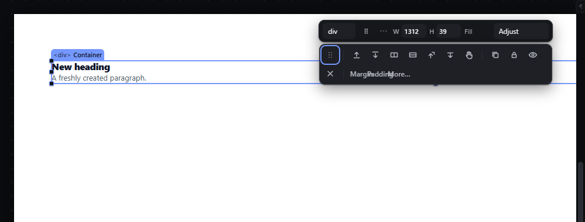
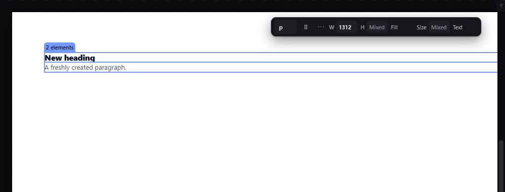

# unwrap — Remove a wrapper and lift its children into its place

How Pager behaves, observed by running it from `.cache/pager-run` (Chrome, window 1600×900) and read from its source. Source references are `path:line` inside Pager. Test document: Section > Container > [Heading, Paragraph].

## Trigger

- Only one door: the **Remove wrapper** button in the selection bar's "More actions" group (`data-act="unwrap"`, `src/features/selection/selection.js:129`, handler `unwrapNode`, `src/app/boot.js:192-217`).
- There is no shortcut, no context-menu item and no menu entry for it.

## Hit zones and thresholds

- The button is **hidden** (not disabled) unless exactly one element is selected, it is a container, it has a parent and it has at least one child (`selection.js:258-259`). Observed: hidden for the Page root and for a Heading.
- Refused, document unchanged, when (`boot.js:193-208`):
  - the wrapper has no children — `Cannot remove <name>. it has no children to lift.`;
  - the parent or a child is locked or hidden — the lock/hidden message;
  - a lifted child would break the nesting rules in the parent — `Cannot remove <name>. Refused. <child> cannot go in <parent>.`

## Visual feedback

| Stage | What is drawn | Image |
|---|---|---|
| Container selected, More actions (`⋯`) open | A second strip of 12 icon-only buttons below the quick panel; the unwrap icon is the sixth. The strip's lower row shows overlapping text ("Margin", "Padding", "More…" drawn on top of each other). |  |
| After Remove wrapper | The Container is gone; the Heading and Paragraph sit in the Section at its old index; **both are selected** (multi-selection, chip `2 elements`); status `Moved 2 children out of Container into Section.` |  |

## Result in the document

`Section > Container > [Heading, Paragraph]` → `Section > [Heading, Paragraph]`, children in their original order, same ids, at the Container's former index (`boot.js:209-213`). The wrapper's own styles are discarded.

## Undo and redo

One history entry: Ctrl+Z restored `Section > Container > [Heading, Paragraph]` with the Container selected (observed).

## Nested elements

Only the direct children are lifted, one level.

## Zoom other than 100 %

Not affected.

## Keyboard equivalent

None in Pager.

## Problems in Pager

1. **Remove wrapper is only reachable through the selection bar's icon strip.** Required: a context-menu item "Remove wrapper" and an Arrange menu item, running the same command (features.json `unwrap`, `context-menu`, `app-menu`).
2. **The button is hidden rather than disabled when the command cannot apply,** so the strip changes layout depending on the selection. Required: the context-menu item stays in place and is disabled, with the reason in its tooltip, for the Page root and for elements without children.
3. **The More actions strip overlaps its own text** (the "Margin", "Padding" and "More…" labels are drawn on top of each other). Required: no overlapping text in any panel; the new app has no separate strip (see `context-menu.md`).
