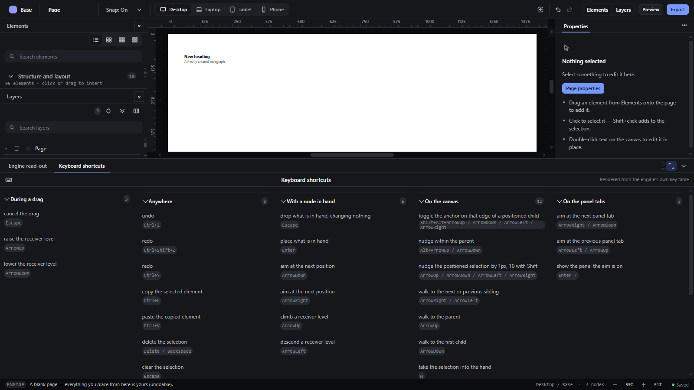

# workbench-panel — Bottom workbench: tabs, collapse, maximise and developer tools

How Pager behaves, observed by running it from `.cache/pager-run` (Chrome, window 1600×900) and read from its source. Source references are `path:line` inside Pager.

## Trigger

- The workbench (`#bench`) sits under the canvas with a tab strip (`src/features/workspace/camera.js:490-509`). Clicking a tab shows that tool; clicking the active tab collapses the workbench (`camera.js:468-473`).
- `#benchToggle` (show/hide) and `#benchMax` (maximise/restore) buttons at the right of the strip (`src/features/workspace/dock.js:279-290`).
- The strip's splitter resizes it (see `panel-resize.md`); tab strip keys ArrowLeft/Right/Up/Down, Home, End move and activate (`camera.js:510-529`).
- View → Developer tools toggles `layout.developer`, which shows the unpinned tools' tabs (`camera.js:502-504`, `dock.js:540-541`).

## Hit zones and thresholds

States (`layout.bench.state`): `collapsed` (tab strip only, 40 px), `open` (observed 160 px, top at 714 px), `max` (observed 508 px, top at 366 px — it covers most of the canvas area).

## Visual feedback

| Stage | What is drawn | Image |
|---|---|---|
| Maximised | The workbench grows over the lower two thirds of the canvas area; the maximise button shows pressed. |  |

Observed transitions: open (160 px) → max (508 px) → open (160 px) → collapsed (40 px) → open (160 px). Turning Developer tools on changed nothing visible in the strip (still `Engine read-out` and `Keyboard shortcuts`).

## Result in the document

None. State and height are saved in preferences.

## Undo and redo

Not applicable.

## Nested elements

Not applicable.

## Zoom other than 100 %

In Fit mode the canvas refits when the workbench changes size.

## Keyboard equivalent

Tab strip arrows/Home/End; no shortcut for show/hide or maximise.

## Problems in Pager

1. **Tabs cannot be closed.** Required: each tab has a close button; closing the last tab collapses the workbench (features.json `workbench-panel`).
2. **Developer tools add no Document tab.** Required: Developer tools adds a `Document` tab showing the live document JSON read-only, updated after every command; the choice is stored in preferences.
3. **Maximised covers only part of the canvas area.** Required: maximise covers the whole canvas area, then restores.
