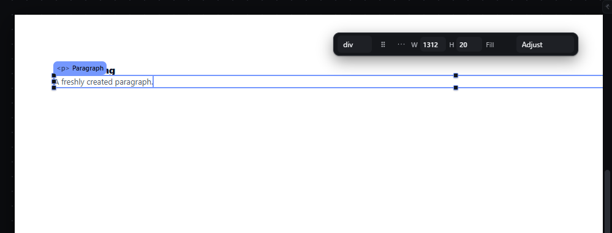
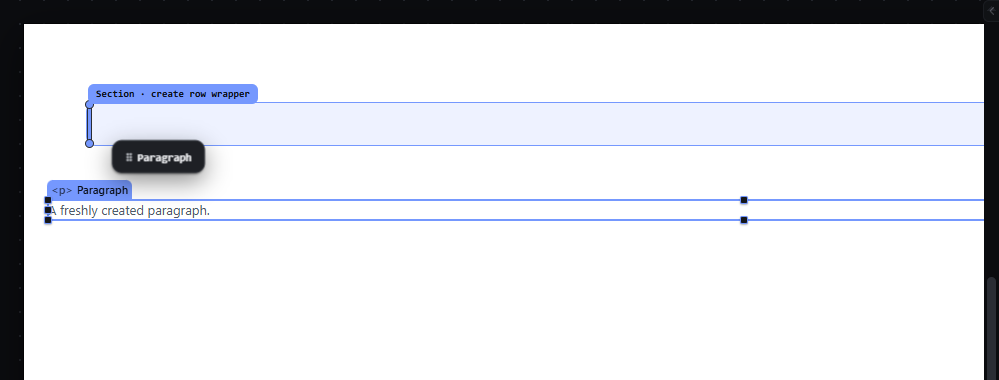
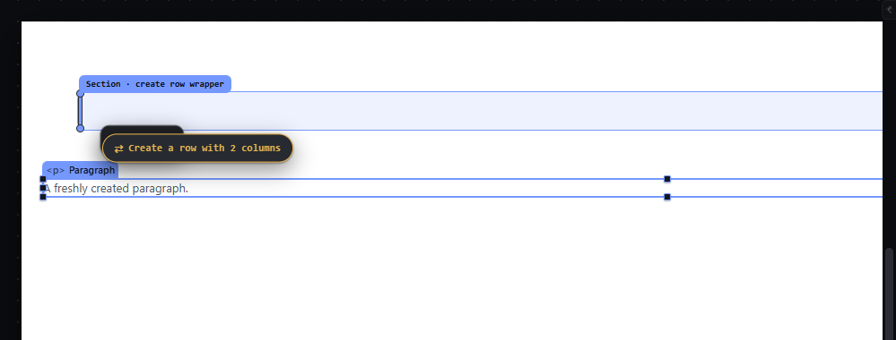
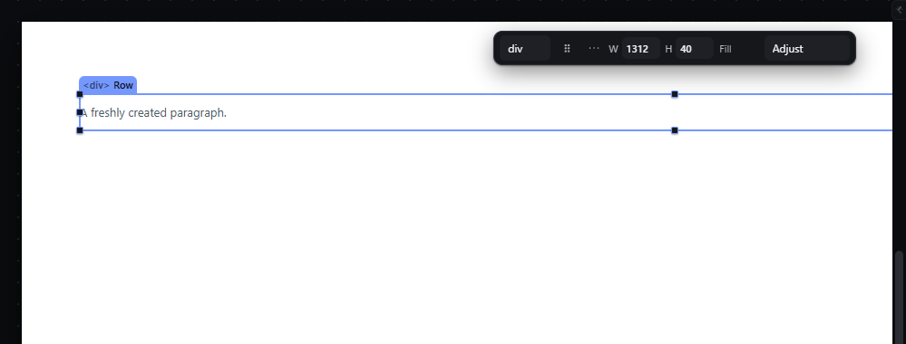

# wrap-row-column — Wrap the selection in a Row or a Column with R and C

How Pager behaves, observed by running it from `.cache/pager-run` (Chrome, window 1600×900) and read from its source. Source references are `path:line` inside Pager. Pager has two doors that create a Row/Column wrapper: the **R/C keys** (this feature) and a **side drop during a drag** (documented here too, because it is the same wrapper concept and the same styles must come from one owner).

## Trigger

### Keys
- `R` wraps in a row, `C` in a column, with the canvas focused and exactly one element selected (`src/features/input/index.js:781-813`).
- Other doors: selection bar "wrap in a row/column" and Arrange menu (`src/app/boot.js:281-282`, `src/features/workspace/dock.js:417-418`); they call the same key row (`runKey`).

### Side drop during a drag
- While dragging an element (or a palette type) over a sibling that fills its parent's cross axis, the pointer inside a **side band** proposes "create a row/column with the target" instead of a reorder (`src/platform/overlay.js:22-42`, `:78-85`).
- After **400 ms** of dwell on the same side, an explanatory pill appears (`src/features/drag/drag.js:1082-1103`, `DWELL:400`). The pill is only an explanation: releasing inside the band wraps whether or not the pill has appeared (`drag.js:1122`, `:1189-1207`).

## Hit zones and thresholds

### Keys
Refused, with the document JSON unchanged, when (`input/index.js:784-800`):
- more than one element is selected — `This action needs one selected element.`;
- the selection is the Page root — `The root cannot be wrapped.`;
- the selection or an ancestor is locked — `🔒 <name> is locked …`;
- the nesting rules forbid a `
` there or the element inside a `
` — `Cannot wrap <name>. <reason>.`

### Side band (drag)
For target *T* in a parent with flow axis *A* (only block/column or row flex parents; not grids, not wrapping flex, not absolute boards; the parent must accept a `
`):

| Parent flow | Condition on *T* | Band | Proposal |
|---|---|---|---|
| vertical (block, column) | width ≥ 82 % of the parent's content width, or *T* is self-sized; width ≥ 72 px unless self-sized; pointer not within 8 px of *T*'s top or bottom | `min(26, 0.22 × width)` px from *T*'s left or right edge | Row with [dragged, *T*] (left band) or [*T*, dragged] (right band) |
| horizontal (row flex) | height ≥ 82 % of the parent's content height; height ≥ 72 px; pointer not within 8 px of *T*'s left or right | `min(26, 0.22 × height)` px from top or bottom | Column with the two |

(`MEASURE_LIMITS.SIDE:26`, `SIDE_MIN:72`, `FILL:.82`, `EDGE_MIN:8`, `src/platform/measure.js:40-49`.) Measured: over a full-width Card (1312 × 40 px) in a Section, the pointer 10 px from the Card's left edge gave `intent row:before`.

## Visual feedback

| Stage | What is drawn | Image |
|---|---|---|
| After `R` on a Paragraph | The new Row appears around the Paragraph and is selected (outline and chip `
 Row`); status `Wrapped Paragraph in a row. Row selected.` |  |
| After `C` (following Ctrl+Z) | The new Column is selected; status `Wrapped Paragraph in a column. Column selected.` |  |
| Drag in the left side band of a full-width element | A **vertical** 3 px line on the target's left edge, the target itself tinted as the "receiver", label chip `Section · create row wrapper`; status `Create Row with Card`; read-out "A horizontal wrapper is born in Section holding both." |  |
| Same, after 400 ms | An amber pill `⇄ Create a row with 2 columns` (`⇅ Create a column with 2 items` in a row parent) appears at pointer +20, +26 px (`drag.js:1093-1095`); while the pointer is within 22 px of the pill the proposal is frozen (`drag.js:966-972`). |  |
| Released | The wrapper exists, holds both elements side by side and is selected; status `✓ Section · create row wrapper`. |  |

## Result in the document

- `R`: a new node `{type: "div", name: "Row" (auto-numbered), styles: {display: "flex", flexDirection: "row"}}` replaces the selection at its index, with the selection as its only child. When the wrapped element is **not a container**, the Row also gets `alignItems: "center"` (`input/index.js:801-810`). Observed: Paragraph → Row with `display:flex; flex-direction:row; align-items:center`; computed style in the iframe `flex row`.
- `C`: same with `name: "Column"`, `flexDirection: "column"`, no `alignItems`.
- Side drop: the wrapper replaces the target at its index and receives [dragged, target] or [target, dragged]; `alignItems: "center"` is added for a row when either element is not a container (`drag.js:1189-1207`). Observed: Paragraph dropped in the Card's left band → `Section > Row{display:flex, flex-direction:row, align-items:center} > [Paragraph, Card]`, Row selected.
- The wrapper styles are written by three separate code paths (`input/index.js:801-810`, `drag.js:1192-1198`, `drag.js:1259-1262`).

## Undo and redo

One history entry per wrap: Ctrl+Z after `R` restored `Section > [Heading, Paragraph]` with the Paragraph selected (observed).

## Nested elements

The wrapper is created in the selection's own parent at the selection's index; nothing else moves.

## Zoom other than 100 %

Keys are not affected. The side bands are measured on zoomed screen boxes (26 px and 72 px are screen px).

## Keyboard equivalent

`R` and `C` are the keyboard doors.

## Problems in Pager

1. **The wrapper styles live in three places** (keys, single drop, group drop). Required: one owner builds the Row and Column wrappers (and the Row/Column templates reuse it; see `templates-layout.md`).
2. **The side drop wraps on release even before the pill appears,** although Pager's own read-out says the wrapper is opt-in (`msg.rule.wrapperOptIn`: "pill (400ms) or Alt"), and Alt does nothing in the code. A drag that brushes a side band while moving to its real target can wrap by accident. Required: if the side-drop wrapper is offered at all, it is created only after an explicit confirmation (the 400 ms dwell or a modifier key named in the hint); without it the drop in that band is an ordinary before/after drop. The indicator must show which of the two will happen.
3. **The row wrapper gets `align-items: center` only in some cases** (when a leaf is wrapped), so R on a container and R on a paragraph give different wrappers without telling the person. Required: one documented default for the Row wrapper, identical for every door; the status names the styles that were added.
4. **Refusals show in the status bar with the `ENGINE` tag** (e.g. `The root cannot be wrapped.`). Required: refusals use the refusal style (danger tag) consistently.
