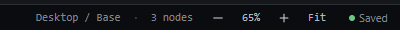

# zoom-keyboard-buttons — Zoom with the keyboard, the status bar buttons and Fit

How Pager behaves, observed by running it from `.cache/pager-run` (Chrome, window 1600×900) and read from its source. Source references are `path:line` inside Pager.

## Trigger

| Input | Effect | Source |
|---|---|---|
| `Ctrl+=` or `Ctrl++` | zoom in by 0.1 | `src/features/workspace/dock.js:569` |
| `Ctrl+-` | zoom out by 0.1 | `dock.js:570` |
| `Ctrl+0` | zoom to 100 % | `dock.js:574` |
| Status bar `+` / `−` buttons | ±0.1 | `dock.js:86-87` |
| Status bar `Fit` | fit the page width | `dock.js:88`, `fitPage` `src/features/workspace/camera.js:188-201` |
| Status bar percentage | nothing: it is a read-out, not a menu | — |

The chords are declared as commands and dispatched from `window` keydown (`camera.js:693-703`, `:879`); they work from the canvas and from panel chrome, not while typing in a field.

## Hit zones and thresholds

- Range: **40 % to 200 %** (`ZOOM_MIN = .4`, `ZOOM_MAX = 2`, `camera.js:167`). Observed: 20 × `Ctrl+-` stopped at 40 %; 30 × `Ctrl+=` stopped at 200 %.
- Keyboard and buttons pivot on the middle of the visible part of the page (`pageAnchor`, `camera.js:160-166`): the page point under that middle stays there (observed: page point (468, 353) → (471, 347) after three zoom-ins, i.e. within a few px).
- Fit: zoom = (canvas width − 2 × 24 px) ÷ page width, rounded to 0.01 and clamped (`camera.js:187-201`); then the page is centred. Observed: 65 % in a 999 px canvas for the 1440 px page.
- Any explicit zoom ends Fit mode (`view.authored = true`, `camera.js:172`); while in Fit mode the canvas refits when its size or the breakpoint width changes (`autoFit`, `camera.js:203-216`, `scheduleAutoFit`).
- The iframe is scaled with CSS `zoom` on `#world` (`camera.js:99-113`).

## Visual feedback

| Stage | What is drawn | Image |
|---|---|---|
| Status bar zoom controls | `−`, the percentage (`65%`), `+`, `Fit`. |  |

The percentage updates on every change (`camera.js:105-107`); Fit writes `Fitted to 65% — the whole page width is on the canvas.` in the status bar. Other zoom changes write no message.

## Result in the document

Zoom never changes the document JSON. It is **not persisted**: after `Ctrl+=` to 110 % and a reload, the canvas opened fitted at 65 % (observed).

## Undo and redo

Not undo steps.

## Nested elements

Not applicable.

## Zoom other than 100 %

This is the zoom feature.

## Keyboard equivalent

The chords above.

## Problems in Pager

1. **The range is 40-200 %.** Required: zoom stays between 10 % and 800 % (features.json `zoom-keyboard-buttons`).
2. **The percentage is not a menu.** Required: clicking it opens a menu with 25 %, 50 %, 100 %, 200 %, 400 % and Fit.
3. **Zoom and Fit mode are not restored after a reload.** Required: the zoom (or Fit mode) is restored after a reload, as a workspace preference.
