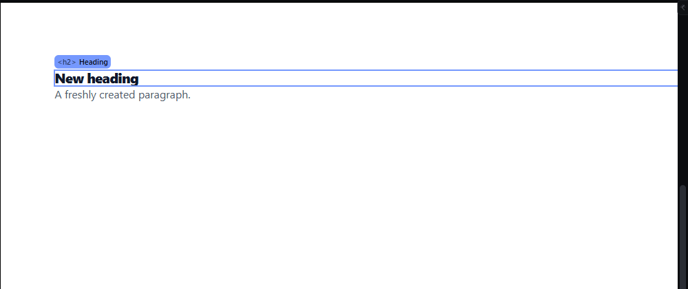

# zoom-wheel-pan — Ctrl+wheel zoom, wheel scroll and Space-drag pan

How Pager behaves, observed by running it from `.cache/pager-run` (Chrome, window 1600×900) and read from its source. Source references are `path:line` inside Pager.

## Trigger

- `wheel` on the canvas stage, and wheel events forwarded from inside the iframe (`src/features/workspace/dock.js:93-94`, handler `handleCanvasWheel` `src/features/workspace/camera.js:233-261`). Ignored in preview.
- **Ctrl/Cmd + wheel** zooms around the pointer; **wheel** scrolls vertically; **Shift + wheel** scrolls horizontally (`wheelPixels`, `camera.js:225-231`).
- **Space held** arms panning: the stage gets the `pan` class and a `grab` cursor (`camera.js:868-872`); a primary-button drag then pans; releasing Space disarms (`dock.js:660-662`). The middle mouse button pans without Space (`dock.js:96-109`). Space is ignored while a text field, button, tab or contenteditable has focus (`camera.js:860-867`).
- `Escape` during a pan cancels it and restores the camera (`camera.js:880-888`, `dock.js:103-106`).

## Hit zones and thresholds

- Wheel zoom factor: `exp(−deltaY × 0.002)` per event (line mode ×16 px, page mode × stage height; `camera.js:225-258`). One 100 px wheel notch → ×1.2214 (observed 100 % → 122 %). The same 40-200 % clamp as the keys; refused travel at a wall is remembered so the next notch back is not wasted (`camera.js:244-257`).
- Anchor: the page point under the pointer stays under the pointer (observed: page point (104, 90) → (104, 89) after the notch; the Heading stayed under the pointer).
- Wheel scroll: the stage scrolls by the wheel delta (observed: 200 px down → `scrollTop` +200; Shift → `scrollLeft` +200). Deltas coming from inside the iframe are multiplied by the zoom (`camera.js:237-240`).
- Pan: the camera moves by exactly the pointer movement (observed: pointer −100, −80 px → scroll +100, +80). No threshold. No element is selected or moved.

## Visual feedback

| Stage | What is drawn | Image |
|---|---|---|
| After one Ctrl+wheel notch over the Heading | The page scales around the pointer; the percentage reads `122%`. |  |
| Space held, dragging | `grab` cursor on the stage (`grabbing` while dragging, class `panning`); the view follows the pointer. |  |

## Result in the document

Never changes the document JSON or the selection (observed after the pan: selection empty as before, outline identical).

## Undo and redo

Not undo steps.

## Nested elements

Not applicable.

## Zoom other than 100 %

This is the zoom feature.

## Keyboard equivalent

`Ctrl+=`, `Ctrl+-`, `Ctrl+0`, Fit (see `zoom-keyboard-buttons.md`); there is no keyboard pan other than the scrollbars.

## Problems in Pager

1. **The wheel zoom is limited to 40-200 %** (same clamp as the keys). Required: 10-800 % (manifest feature `zoom-keyboard-buttons`).
2. **The Space pan arm stays active only while the stage has no focused control,** so pressing Space while a panel button has focus scrolls or activates that button instead of panning, without feedback. Required: Space pans whenever the pointer is over the canvas and no text field or contenteditable has focus, nor a control the keyboard focused (reached with Tab or the arrows, not during a pointer press) whose own Space runs (a palette tile inserts its element: the audit's A1.1, elements-lists); a control a click left focused never keeps the Space from the pan; the grab cursor shows while Space is held and disappears when it is released (manifest feature `zoom-wheel-pan`).
